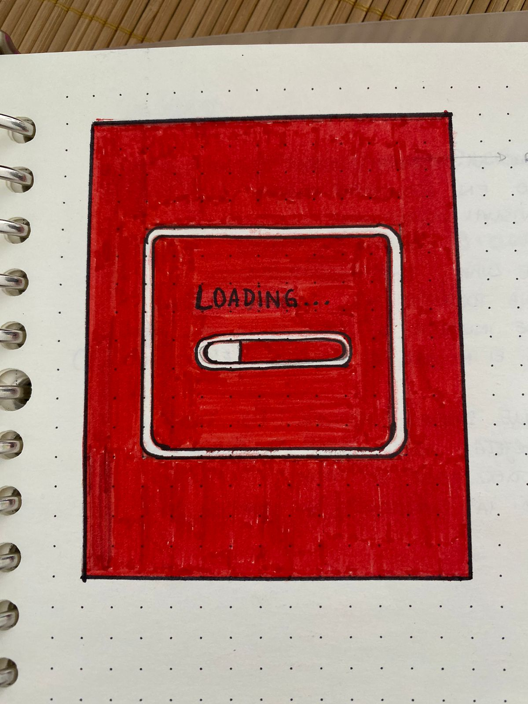
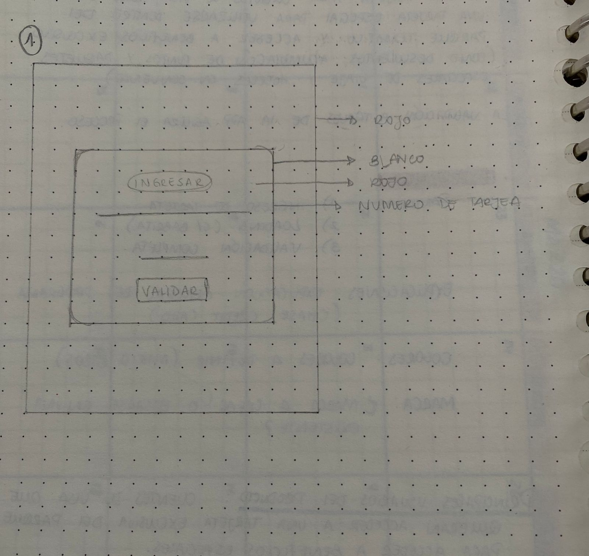
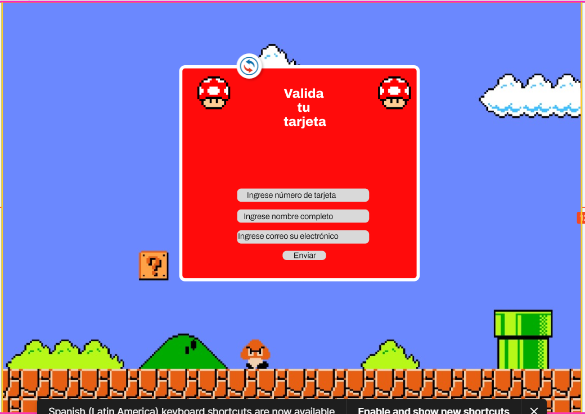
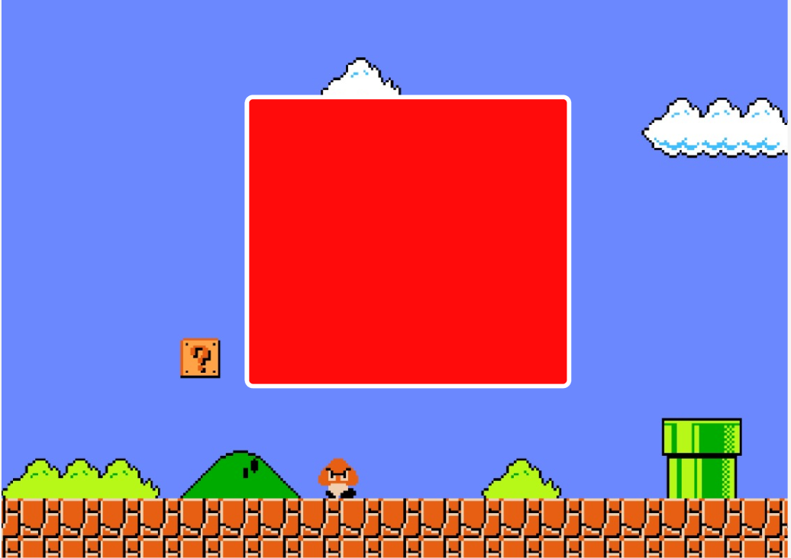
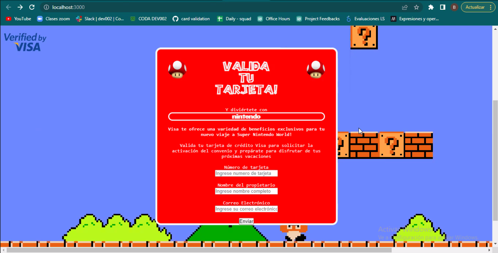
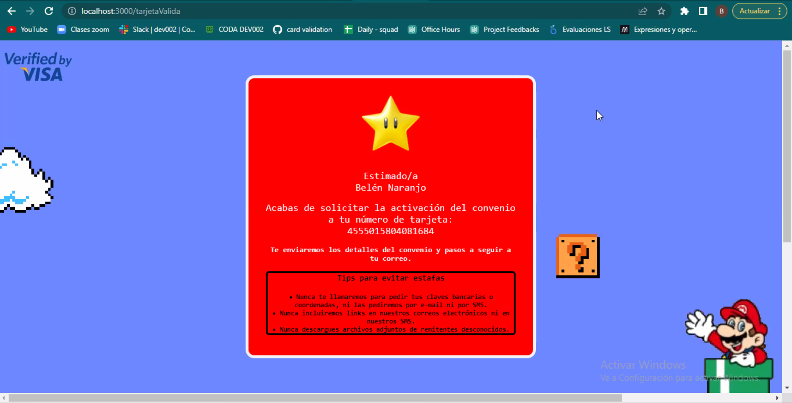

# **Tarjeta de crédito válida**
 - Convenio de parque temático (Super nintendo World) con tarjeta de crédito Visa

## **Resumen de mi proyecto**

Esta app le permite al usuario/cliente de visa, solicitar la validación de su número de tarjeta para ser parte del convenio con el parque temático, que le otorga beneficios exclusivos como: descuentos, acumulación y canje de puntos, etc.

## **Imagen de mi primer prototipo en papel**

Este prototipo de baja fidelidad fue pensado principalmente en los colores de nintendo. Contaba con 2 pantallas. El primero con el ingreso de datos, el segundo con el resultado de los datos ya ingresados.

## **Investigación UX**

**1. Explicar quiénes son los usuarios y los objetivos en relación con el producto:**
   * Los usuarios son personas que utilizan tarjetas de crédito en viajes. Al ser un parque temático de nintendo, el principal público objetivo también son usuarios de nintendo (videojuegos). 

**2. Explicar cómo el producto soluciona los problemas/necesidades de dichos usuarios:**

  Este producto da enfasis en una de las principales necesidades de los usuarios de tarjetas de crédito que es poder acceder a exclusividades, tales como: descuentos, convenios, cupones, acumulación de puntos. A su vez, el publico que asiste a parques tematicos en su mayoria utilizan tarjetas de crédito porque es más seguro y además, pueden optar a pago en cuotas. También le permite al usuario facilitar la tramitación del convenio, ahorrar tiempo de filas en sucursales y resolverlo de forma virtual. 

## **Imagen del prototipo final**

Basandome en el formato web de Super nintendo World, decidí modificar mi prototipo de baja fidelidad, y hacer uno con una temática mas atractiva.

Primera pantalla: Recopilación de datos

Segunda pantalla: Datos válidos + mensaje. 

# **Feedback**

# **imagen final del proyecto**

